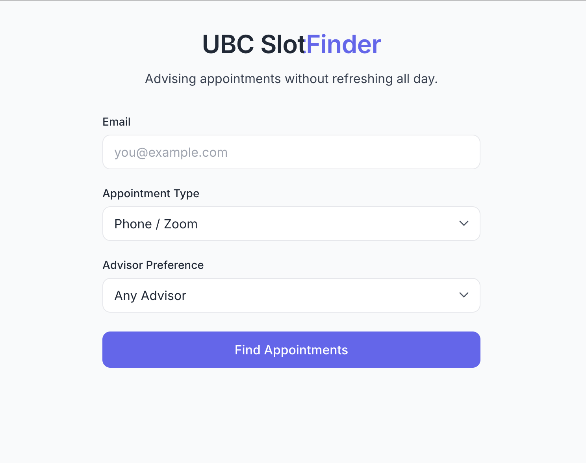
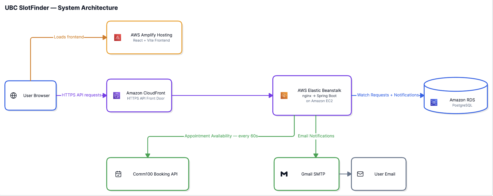

# UBC SlotFinder

A deployed web application that monitors UBC academic-advising appointments and emails students when new appointment slots become available.

**Live Demo:** [UBC SlotFinder](https://main.d3khqm2y4ubb0n.amplifyapp.com)

UBC SlotFinder replaces constantly refreshing the appointments-page with automated monitoring.



## How It Works

1. A student creates a watch-request with their email, appointment type, and advisor preference.
2. The Spring Boot backend stores the request in PostgreSQL.
3. Every 60 seconds, a scheduled job checks the Comm100 booking API for matching appointment-slots.
4. When a matching slot is found, SlotFinder checks PostgreSQL to avoid sending a duplicate notification.
5. The user receives an email alert and can unsubscribe through a token-based link without creating an account.

## Architecture

SlotFinder is split into a separately deployed React frontend and Spring Boot backend. The frontend is hosted on AWS Amplify, while API requests are sent through CloudFront to the backend running on AWS Elastic Beanstalk. The backend persists watch requests and notification history in Amazon RDS for PostgreSQL, polls the Comm100 booking API for appointment availability, and sends email alerts through Gmail SMTP.



## Tech Stack

| Area | Technologies |
| --- | --- |
| **Frontend** | React, Vite, JavaScript, HTML/CSS |
| **Backend** | Java, Spring Boot, Spring MVC, Spring Data JPA |
| **Database** | PostgreSQL, Hibernate |
| **Infrastructure** | AWS Amplify, CloudFront, Elastic Beanstalk, EC2, RDS |
| **Integrations** | Comm100 Booking API, Gmail SMTP |
| **Development** | Maven, Git, GitHub, Swagger / OpenAPI |

## Engineering Highlights

### Making Duplicate Prevention Persistent
The first version of SlotFinder tracked sent notifications in memory, which meant that restarting the backend erased that state and could cause the same appointment to trigger another email. I moved duplicate detection into PostgreSQL using a deterministic key derived from the recipient and appointment slot, so notification history survives restarts and deployments.

### Designing Unsubscribe Without User Accounts
SlotFinder intentionally avoids requiring students to create accounts, which made authenticated unsubscribe requests impractical. Instead, each watch request receives a randomly generated token that is embedded in notification emails and used to identify and deactivate the associated monitoring requests.

### Debugging the Production AWS Deployment
The backend initially returned `502 Bad Gateway` after being deployed to Elastic Beanstalk. Tracing the request path from nginx to Spring Boot revealed that the application was failing during startup because it could not reach PostgreSQL on RDS; configuring security-group access between the EC2 instance and RDS resolved the issue.

### Serving an HTTPS Frontend with an HTTP Backend
AWS Amplify served the React application over HTTPS while the initial Elastic Beanstalk endpoint was HTTP, causing browsers to block API requests as mixed content. I added CloudFront as the HTTPS front door for the backend API, allowing the deployed frontend to communicate securely with Elastic Beanstalk.

## Local Development

### Prerequisites

- Java 25
- PostgreSQL
- Node.js 20.19+ and npm
- Gmail app password if testing email notifications

### Backend

Set the following environment variables:

```bash
SPRING_DATASOURCE_URL=jdbc:postgresql://localhost:5432/slotfinder
SPRING_DATASOURCE_USERNAME=your_postgres_username
SPRING_DATASOURCE_PASSWORD=your_postgres_password
SPRING_MAIL_USERNAME=your_email
SPRING_MAIL_PASSWORD=your_app_password
```

Then start the Spring Boot application:

```bash
cd backend
./mvnw spring-boot:run
```

The backend runs on `http://localhost:8080`.

### Frontend

Set the frontend API URL:

```bash
VITE_API_BASE_URL=http://localhost:8080
```

Then:

```bash
cd frontend
npm ci
npm run dev
```

The frontend runs on `http://localhost:5173`.

## Future Improvements

- **Automatic appointment booking** — Extend SlotFinder from just monitoring appointments to actually booking the appointment for the user.
- **Production observability** — Add structured logging and health/metrics endpoints for easier monitoring and debugging.
- **Notification batching** — Combine multiple matching appointment slots into a single email rather than sending individual notifications.
- **Email infrastructure** — Move from Gmail SMTP to a transactional email provider as usage grows.

